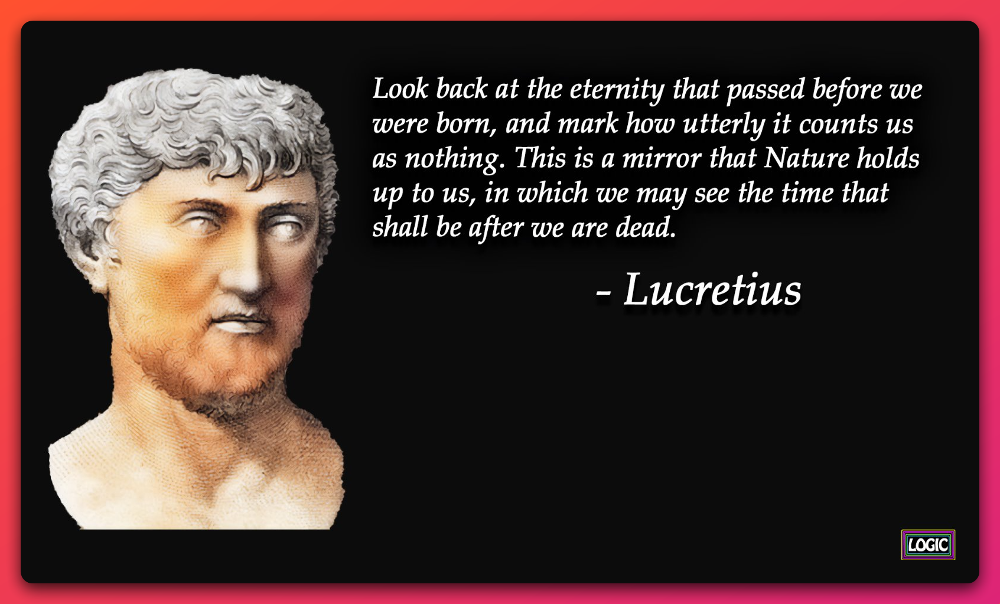

# How to Present Your Argument

This tutorial focuses on how to present philosophical arguments in the context of a paper. It is not designed to teach you argumentation or *how to argue*. The latter topics exceed a single tutorial. 

## Two Ways to Present Your Argument

There are two main ways to present your argument. Let's call the first an *in-text argument* and the second in *argument standard form* (or *standard form*).

## In-text arguments

 In the case of an in-text argument, you simply write the argument in the body of the paragraph. At minimum, an in-text argument will include a conclusion and a premise (or reason). 

Let's consider a very simple example:

> God exists. Yesterday, I prayed for a way to pay my rent. And, today my landlord said he would give me another week to pay my rent.

In the above paragraph, there is the conclusion ("God exists") and a premise (reason) in support of that conclusion. The premise in the above argument is something like "there is observational evidence of God's existence through the answering of prayers."

Let's consider a more complex example from Lucretius:

    
Argument text

    
"Look back at the eternity that passed before we were born, and mark how utterly it counts us as nothing. This is a mirror that Nature holds up to us, in which we may see the time that shall be after we are dead.

While more difficult to identify, the above argument contains a conclusion and a few premises. The conclusion is that we are nothing after we die. The premises are (1) we were nothing before we were born and (2) our nonexistence before we are born is  like our nonexistence after we die in all relevant respects when it comes to nature.

My general recommendation is to present your argument as an in-text argument when

1. Your argument is easy to understand.
1. The premises and conclusion are easy to spot.
1. You don't need to refer to specific parts of your argument later.

### Argument Standard Form

The second way of presenting your argument is in some version of what is known as "argument standard form". In argument standard form, you present your argument by first indenting from the body of the text and then listing and labeling the propositions of your argument. The premises of your argument are labeled as P1, P2, P3, and so on, while your conclusion is labeled as C. 

Here is a simple example:

- P1: Prayers are answered by God.
- C: Therefore, God exists.

The above argument contains a single premise (labeled 'P1') and a conclusion (labeled 'C'). 

Next, consider a more complex argument. 

- P1: There was a time (before our birth) where we did not exist (our "pre-vital nonexistence").
- P2: There will be a time (after our death) where we will not exist (our posthumous nonexistence)
- P3: Our prevital and posthumous nonexistence are alike in all relevant respects.​ 
- P4: If our prevital nonexistence isn't bad, then our postvital nonexistence isn't bad.
- C: Therefore, our nonexistence after we die is not bad for us.

Notice that the above argument contains a conclusion ('C') and contains four premises ('P1', 'P2', and so on). 

There are three additional features of argument standard form worth mentioning. First, some arguments are complex and involve "intermediate conclusions". This is a conclusion that also serves as a premise in the argument. Here is an example:

- P1: I prayed for my rent to be paid.
- P2: My rent was paid.
- IC: Therefore, my prayer was answered.
- C: Therefore, God exists.

In the above example, "IC" is the intermediate conclusion. It follows from P1 and P2 but is used to support C.

Second, one might wish to modify a premise in an argument but keep the original statement of the argument. For example, suppose you put forward the following argument:

- P1: Everyone believes in God.
- C: Therefore, God exists.

Someone then points out that P1 is false. In response, you plan on modifying your argument. To do this, you can copy and paste the argument, but modify P1, noting that P1 is modified by adding an asterisk:

- P1*: Most people believe in God.
- C: Therefore, God exists.

Now it is clear that P1* is a modification of the original P1. 

Third, in some cases, someone may ask you to provide an argument for your premise. For example, consider the following argument that supports P1*:

- P1.1: A 2022 Gallup poll found 81% of people in the U.S. believe in God.
- P1.2: Of the 19% who say they don't believe in God, a portion of these people believe in a "higher power".
- P1: Most people believe in God.

Notice that in the above argument, the conclusion is P1, which serves as a premise in an earlier argument.

### Strengths of Standard Form

There are several benefits to presenting an argument in standard form.

First, if we needed to explain, justify, or criticize one of these premises, we can refer back to it without having to rewrite it or refer to it in a fuzzy way. For example, if someone asked us to clarify P1, we could write the following:

> "Premise "P1" says for any person, there was a time before their birth. The person's state of being before their birth is called their "prevital nonexistence". For example, suppose Tek was born in 2000. In 1990 he does not exist but we can refer to his state of being as his prevital nonexistence.

Second, arguments in standard form tend to be more explicit about which propositions in the argument are premises (reasons) and which are the conclusion. This is beneficial since readers do not have to guess (1) how many premises the argument contains or (2) which propositions are your reasons and which is the conclusion.

Third, putting arguments in standard form is also beneficial for the initial development of an argument. Since the premise-conclusion of the argument is made explicit, some people will better realize that (1) they do not have clear reasons for their conclusion or (2) their reasons are just a restatement of their conclusion. For example, the conclusion in the argument below is just a restatement of the premise:

- P1: I think there is strong evidence that God exists.
- C: Therefore, there is good reason for believing in God.

## Video Resources

1. [Argument Standard Form](https://www.youtube.com/watch?v=EVpOMUav_uE) 
1. [Explaining Philosophical Arguments](https://www.youtube.com/watch?v=EWEKuxvGLLo) by Ryan Pollock
1. [How to Criticize a Philosophical Argument](https://www.youtube.com/watch?v=HnA7pLVmePM) by Ryan Pollock

