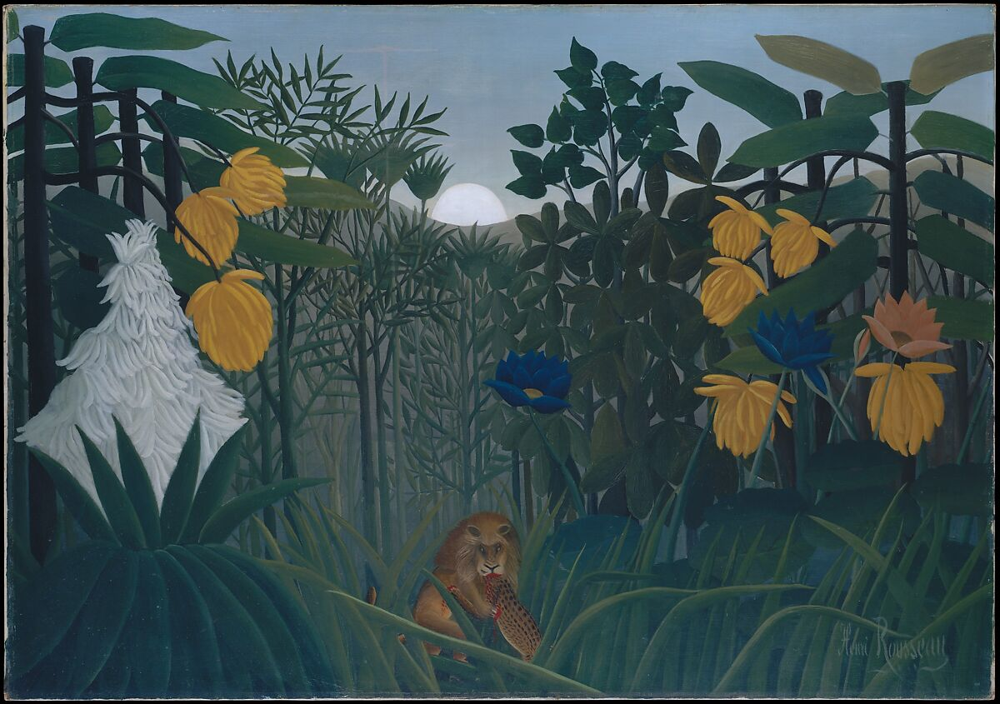

# How to Cite

When you use a source, you should provide sufficient information about the source so other people can identify it. This is known as a "citation". Why cite the works you use from others? Three reasons:

1. Society expects you to and will sometimes punish you if you don't. At a university, you may be charged with an [academic integrity violation](https://undergrad.psu.edu/aappm/G-9-academic-integrity.html). In broader society, you might face public humiliation, criticism, or even lose your job (e.g., it has been claimed that former president of Harvard University resigned due to [plagiarism allegations](https://www.theguardian.com/education/2024/jan/06/harvard-claudine-gay-plagiarism))
1. It is helpful to others. If I'm interested in the topic of your paper and your paper was inspired by a set of readings, I might like to read what you read.
1. If you pretend something is yours when it's not, you are lying. If you take another's ideas or results, then you are stealing. In general, lying and stealing are taken to be morally wrong.

To regularize things, when you cite a source, you are expected to use a *citation style*. There are many different citation styles, e.g., [Chicago/Turabian](https://owl.purdue.edu/owl/research_and_citation/chicago_manual_17th_edition/cmos_formatting_and_style_guide/chicago_manual_of_style_17th_edition.html), APA, MLA, IEEE, etc. If you are publishing a paper, the style you use will vary based on the academic discipline you are in and the place you are publishing your paper (or book).

---

## How do you Cite?

How do you cite? Let's answer this question in two parts: *in-text citations* and *reference citations*.

### In-text Citations

As the name implies, in-text citations are citations in the text you are writing. They typically involve identifying the author of work and the date in which the work was published. There are two main types:

1. *Parenthetical citations* refer to the author or authors and the date of the publication in parentheses (typically placed at the end of a sentence).
1. *Narrative citations* incorporate the author's or authors' names into the sentence itself and include the date publication in parentheses.

Let's look at an example of each.

- Parenthetical in-text citation: One study showed that students who engaged in spaced studying recalled more information (Smith 2010).
- Narrative in-text citation: Smith (2010) showed that students who engaged in spaced studying recalled more information

It is also common to incorporate the page number of the source you are using. Here is an example:

- Parenthetical in-text citation with page number: One study showed that students who engaged in spaced studying recalled more information (Smith 2010: 31).
- Narrative in-text citation with page number: Smith (2010: 31) showed that students who engaged in spaced studying recalled more information

## Reference Citations

Now that you know the basics of in-text citations, let's consider the other type of citation: reference citations. These citations are typically found at the end of your paper or book. They provide more detailed information about the source you used in the text.

Again, there are many different styles. We will ignore the minute details of these styles and focus on their common features. Reference citations typically involve enough information to *uniquely* and *easily* identify the source you used. With this in mind, these citations typically include:

1. The author's name (typically last name first), e.g., Agler, David W.
1. Title of work, e.g., *Symbolic Logic: Syntax, Semantics, and Proof*
1. Date work was published, e.g., 2012.
1. Page numbers of the article, e.g., pp.11-22.
1. Who published it, e.g., *Oxford University Press.* (for books)
1. Where it was published, e.g., New York (for books)
1. Issue or Volume (for journals)
1. URL or DOI, e.g., <https://doi.org/10.2979/trancharpeirsoc.2010.46.4.611>

Keep in mind that you could provide more information about the book. You could optionally provide:

1. Number of pages
1. Abstract of the source
1. The printing
1. The language in which it is written
1. Call number

Here is a sample citation of an article with a single author, an article with two authors, and a book:

- **Article with one author:**  
  Agler, David W. *Peirce and the Specification of Borderline Vagueness.* *Semiotica*, no. 193 (2013): 195–215.

- **Article with two authors:**  
  Pollock, Ryan, and David W. Agler. *Hume and Peirce on the Ultimate Stability of Belief.* *Pacific Philosophical Quarterly* 97, no. 2 (2016): 245–69. [https://doi.org/10.1111/papq.12118](https://doi.org/10.1111/papq.12118)

- **Book:**  
  Agler, David W. *Symbolic Logic: Syntax, Semantics, and Proof.* Lanham: Rowman & Littlefield Publishers, 2013.

If you are not going to use a citation style or bibliographic software, my advice is that when initially creating your reference page, to use the guidelines above concerning *what* information to include in your citations and be consistent. That is, when citing a source, you should use as much of the information about the source as possible. In addition, you should be consistent by using a single format. Here is what I recommend:

```text
(Author)(Date)(Title of Work)(Place of Publication):(Publisher)(Volume Number)(Issue)(page numbers)(URL).
```

---

## What to Cite

You do not need to cite:

1. Common knowledge, e.g. that water is H2O.
2. Facts that are widely known within certain groups even though they are not widely known in general, e.g., Maxfield Parrish was an American painter.

You do need to cite:

1. Verbatim language belonging to an author or source, e.g., a quotation from a speech or book.
1. Interpretations, assertions, or theories that can be tied to individuals (unless they are widely held)
1. Information that is not widely accessible, e.g., an idea in an unpublished manuscript

What about images or diagrams? For example, what if I'm writing a paper and I include the following image of a lion devouring some being?



Yes, you should cite it just like you would cite a passage of text you are quoting . You should include:

1. The Artist's Name
1. The Title of the Artwork (typically italicized)
1. The Date of Creation
1. The Medium
1. Its location
1. URL if you taking it from an online source

Here is an example:

> Rousseau, Henri. c. 1907. *The Repast of the Lion*. Oil on Canvas. The Met Fifth Avenue. Oil on Canvas. URL: <https://www.metmuseum.org/art/collection/search/438822>

---

## Using Technology

Now that you know the basics of in-text and reference citations, let's shift our focus to making our lives easier. Realistically, if you want to publish a work, you will need to put it in the style of the publication. You could do this by hand, *but why?*

My advice is to do the following:

1. For Students: Take your references on your reference page, put them into a LLM (e.g., ChatGPT) and then tell ChatGPT to create a reference page with the style that you want. Check for consistency and accuracy.
2. Use citation / bibliographic software, e.g., Zotero. For a tutorial, see here: [Zotero - A Quick Introduction](https://youtu.be/Iq7V2X5x2Pk). If you plan on writing papers in the future that have citations, using citation software will save you a significant amount of time since it will also manage all of your files.

## Exercise

Create a fictional resource (e.g., a book or article you wrote), then provide a sentence that makes use of an in-text citation and also supply its reference citation.
