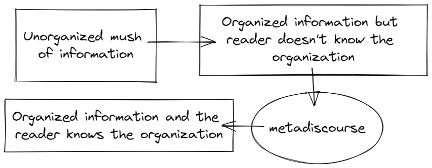
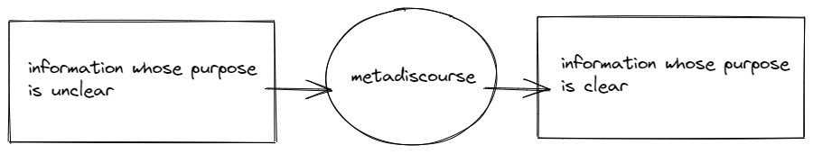
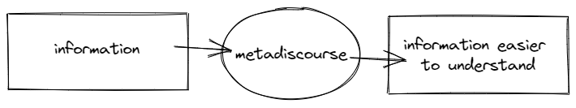

# How to Use Metadiscourse

Language is not simply used to convey information. It can be used to threaten, to amuse, to enter transactions, to get out emotions, and so on. In addition to these uses, Hyland (2005) points out, language is also used to "present this information through the organization of the text itself \[...] and engage readers as to how they should understand it." Language that fulfills this aims to perform function is called *metadiscourse*. There are many different definitions of "metadiscourse". Some include:

- Hyland (2017) defines it as follows: "Metadiscourse is the commentary on a text made by its producer in the course of speaking or writing. \[...] At the heart of the idea is the view that language not only refers to the world, concerned with exchanging information of various kinds, but also to itself: with material which helps readers to organise, interpret and evaluate what is being said. \[...] Essentially metadiscourse refers to how we use language out of consideration for our readers or hearers based on our estimation of how best we can help them process and comprehend what we are saying." 
- Vande Kopple (1985): "the linguistic material which does not add propositional information but which signals the presence of an author".
- Crismore (1983:2, cf. Crismore et al 1993:40): "the author's intrusion into the discourse, either explicitly or non-explicitly, to direct rather than inform, showing readers how to understand what is said and meant in the primary discourse and how to "take" the author.''

For our purposes, we will take metadiscourse to be defined as follows:

> Metadiscourse is the use of language (broadly understood) to **organize propositional information** and **manage information flow** to the reader. This is sometimes referred to as the **interactive part of metadiscourse** (the other part is the interactional part, but we will ignore that). 

On this definition, metadiscourse does not refer to: 

1. the organization of linguistic items (syntax), or
1. a fixed set of terms or expressions, or
1.  the language you use to talk about a language. The language you use to talk about another language is a "metalanguage"

Instead, metadiscourse refers to language that performs a certain set of not-purely informational functions. In what follows, let's consider three such functions:[^non_verbal]

|  |Function | Type of Metadiscourse |
|---|:---|:---|
| 1 | communicate the **organization** of information | sequencing markers |
| 2 | **frame** the purpose / goal / aim of information | frame markers |
| 3 | make the information **more understandable** | code glosses |

## Sequencing Markers

Sequence markers refer to the use of language to sequence ideas or to order information in a sequence ("First, Second, Third, etc."). This sequence might refer to the temporal sequence, the stages of a discussion, or the logical flow of ideas. As Hyland puts it:

> "\[Sequence markers are used to] sequence parts of the text or to internally order an argument, often acting as more explicit additive relations (first, then, 1/2, a/b, at the same time, next), They can explicitly  label text stages '(to summarize, in sum, by way of introduction)." (Hyland 2005)

Let's consider an example motivated by oral arguments in front of the 2022 US Supreme Court. Suppose Tek believes that race-conscious decisions in higher-education admissions is morally wrong and unconstitutional. He thinks that colleges and universities should not consider an applicant's race when determining whether that student applicant should be admitted to the university. He thinks that a person's race may play a role in other parts of their lives that are relevant for whether they should be accepted (e.g., if they faced discrimination due to being a member of a certain race or if their racial identity was a factor in their intellectual/cultural development), but that race *alone* should not be a factor.

Tek wants to convey clearly to the supreme court justices (1) the content of his view and (2) why his view is correct. Suppose he has three reasons for his view. He can state the view and his reasons in any random order, and so he does. He has three things to say and so he begins to talk about his reasons **seemingly at random:** He talks about reason 1 for a little bit, then reason 2, then reason 1 again, then reason 3, then reason 1 again. Sometimes he will talk about previous case law, other times, he will discuss college admission practices, and still other times he may give an indication of what he believes about the matter. His ideas are organized around a central theme or idea but there is no additional organization to his thoughts.

Now this would not be an effective way to communicate since Tek's thoughts are **not organized**. Let's suppose that Tek is scolded by his colleagues and he redrafts the statement he plans to make to the Supreme Court. Instead of randomly uttering whatever is on his mind (all being about the three key points) relating to college admission practices, he organizes the flow of information into discrete chunks:

- Stage 1: State and clarify his thesis.
- Stage 2: State the first reason. Then talk just about this reason.
- Stage 3: State the second reason. Then talk just about this reason.
- Stage 4: State the third reason. Then talk just about this reason.

In the above example, the information that Tek wants to communicate is divided into *four* discrete parts and they are delivered in a specific order. The information is organized and Tek may know its organization given how he has decided to select from the information he wants to communicate. 

However, just because Tek knows how his ideas are organized does not mean the Supreme Court Justices know how the information is organized. *Tek wants to not only organize the information, but make this organization known.* He not only wants to organize his thoughts but he wants to communicate this organizational structure to his listeners. To fix this problem, Tek can use metadiscourse (sequencing markers) to explicitly communicate the flow (or organization) of information.

Tek can do this by using metadiscourse (terms that explicitly indicate the organization of the information). Here are some ways that Tek can use metadiscourse (bolded terms are metadiscourse (sequencing) terms):

- States thesis -> **First**, reason 1. **Second**, reason 2. **Third**, reason 3.
- States thesis -> **First**, reason 1. **Next**, reason 2. **Finally**, reason 3.
- States thesis -> **In this section,** reason 1. **In this next section,** reason 2. **In this final section,** reason 3 (assumes writing a paper)

Notice that the above examples do not communicate any information about the content of what Tek thinks (except in a minimal way). Instead, what they do is to make explicit how the information he is uttering is being packaged or organized. In using metadiscourse markers, he is making it clear when he is transitioning from one reason to the next. 

We might distinguish between two different types of sequencing. **Global sequencing** would refer to using language to sequence the entirety of a piece of discourse, e.g., a paper or a speech. 

- In this paper, I will make three key points.
- This paper is organized in two sections. In section 1, I will do X. In section 2, I will do Y.
- There are two key ideas to understand about this argument. First, X. Second, Y.

Alternatively, **local sequencing** would refer to using language to sequence smaller subsections of a piece of discourse. For example, suppose we are writing a paper and the paper contains an argument within a section. We might write the following:

- P1: Death is nonexistence.
- P2: A nonexistent being cannot be harmed.
- C: Therefore, death is not bad for the person who dies. 

In using P1, P2, and C, we provide information to the reader about the structure of the argument. In this example, we are indicating the logical sequence of the information.

Let's look at an example from an oral argument from Cameron T. Norris (this involved a US Supreme Court case: [Students for Fair Admissions, INC., v. President and Fellows of Harvard College](https://www.supremecourt.gov/oral_arguments/argument_transcripts/2022/20-1199_g314.pdf)). Skim the following passage and indicate any metadiscourse sequencing elements you find. 

> MR. NORRIS: Mr. Chief Justice, and may it please the Court: Grutter assumed that universities could use race in a narrowly tailored way if they just did it like Harvard. But this Court never had any evidence about Harvard. Now you do, and that evidence proves that none of Grutter's core assumptions were ever true. 
> 
> First, Grutter assumed that race would only be a plus. But race is a minus for Asians, a group that continues to face immense racial discrimination in this country. Asians should be getting into Harvard more than whites, but they don't because Harvard gives them significantly lower personal ratings. Harvard ranks Asians less likable, confident, and kind, even though the alumni who actually meet them disagree. What Harvard is doing to Asians, like what it was doing to Jews in the 1920s, is shameful, but it's a predictable result of letting universities use race in highly subjective processes.
> 
> Second, Grutter assumed that applicants would be treated as individuals, not as members of racial groups, but Harvard gives racial preferences based on the box that applicants check, even if they never write about race or explain how it influences their views. And for competitive applicants, checking the right racial box is an anvil on the admissions scale, worth the same as ultra rare achievements like winning a national championship. 
> 
> Third, Grutter assumed that universities would seriously consider race-neutral alternatives, but Harvard never once did so until 2017, three years after we sued it. Harvard now refuses to eliminate its legacy preferences or boost its socioeconomic preferences, even though both changes would make Harvard far less white, wealthy, and privileged. That's how Harvard uses race, and Harvard is supposed to be the model. This Court should admit that it was wrong about Harvard, wrong about Grutter, and wrong about letting the poison of racial classifications seep back into education. Grutter should be overruled both for public schools and for private schools that accept federal funds.[^supreme]

Finally, it is worthwhile to point out that language is not only used to communicate information to others but also to communicate our own ideas to ourselves. Using sequence markers can be useful for structuring and organizing one's own thoughts.

## Frame Markers

The next type of metadiscourse that we will consider are called "frame markers". To illustrate, let's  consider a hypothetical example based on a rather commonplace occurrence in the workplace. A group of employees are unhappy with some policy in the workplace (e.g., healthcare benefits, workplace environment, salary, etc.). They collectively raise these concerns with their supervisors. In response, the supervisor tells a personal anecdote. Here is a hypothetical one:

> You know. Let me say first, when I started working here 20 years ago (that was in 2000) things were a lot different. I remember the first day I walked into the office and I met Nancy Smith. I'll never forget what Nancy Smith told me. She said never to be too rigid because a rigid stick is more likely to break than one that bends. Now since I've started working here I've always put the well-being of my employees first and doing that requires being nimble. Let me tell you another thing \[insert more rambling here]. Fifth and finally, I think if we band together, we can respond quickly, efficiently, and nimbly to whatever hardships we might face. 

The above passage contains information, and there may be some metadiscourse (sequencing) to it, but it is unclear what the supervisor is trying to communicate. Is this an answer to the question raised by the employees? Is the personal story an analogy for the employee's situation? Or, is the supervisor simply rambling?

Such communication occurs in academia, in the workplace, in relationships, in the media, and in politics. Writers express a considerable amount of information but it is unclear what (if any) the point, or conclusion, or purpose of the writing. 

But what is *my* point in this example? The point is that individuals can fail to effectively communicate even though they utter well-ordered chunks of information where each sentence in the chunk is clearly reformulated and exemplified. This is because, **in certain contexts, effective communication requires a purpose, goal, or aim and the communication of that purpose, goal, or aim**. An academic may wish to cite a passage or raise an argument to prove a thesis. A political may wish to tell a story or anecdote to inspire a crowd. A boss may want to have their employees to implement a new work policy. But, in some cases, it is not obvious that is what they are trying to do. In order to make clear one's purpose, one can imply *frame markers*.

> An individual uses a **frame marker** when they use language to **communicate the aim, goal, or purpose of the information**. 

Some frame markers include: 

- The goal of this paper, ...
- The aim of this section, ...
- My intention is to ...
- My objective is to ...
- My purpose is to ...
- My answer to this question is ... 

Using frame markers is effective for communicating because it tells your reader **the purpose of the information that you are communicating to them**. You are not merely communicating interesting pieces of information but are communicating with a purpose.

## Code Glosses

The next type of metadiscourse we will examine are code glosses. Code glosses are defined as follows:

> "code glosses are used to elaborate on what has just been said by the writer." (Chalak 2016:10)

Code glosses are uses of language whose function is not intended to convey new information but instead to signal that content is being presented to make information (usually information that has already been presented) **more understandable** to the reader. There are two different subfunctions of code glosses: **reformulation** and **exemplification**.

First, you **reformulate** a sentence when you state the sentence using different words. Reformulation of a piece of information is often performed with the goal of making information **easier to understand**. Remember that metadiscourse itself is language that signals something about the information being presented. And so, various metadiscourse terms that are code glosses are terms that explicitly indicate that reformulation is occurring, has occurred, or is about to occur. Some examples include:

- Sentence (S1). **In other words,** S1 is saying that ... 
- Sentence (S1). **Namely**, ...
- Sentence (S1). **What this means is**, ...
- Sentence (S1). **To put this in another way**, ...
- Sentence (S1). **What I mean is ...**

Second, exemplification occurs when you **illustrate** the meaning of propositional information by using an example. The idea is that the meaning present in propositional information is obtainable from the example. Exemplification is often used since some ideas are presented **abstractly** and examples tend to be **concrete**. The concrete nature of examples can make the information easier to understand since it is more closely related to a reader's experience. For example, suppose Tek believes in the ethical theory of deontology. He thinks that a particular act is morally permissible if and only if they follow the following categorical maxim: an act is morally permissible for a person if and only if it they act based on some maxim can be consistently willed to be a universal law. People unfamiliar with the maxim may not understand what this means and so in an effort to explain his theory Tek might provide several examples to illustrate when an individual does and does not obey this maxim. 

Various metadiscourse terms are used to explicitly indicate that exemplification is occurring, has occurred, or will occur. Some include:

- **For example**, X
- **For instance**, X.
- **Such as**, X
- **An instance of** Y is **illustrated in** X.

# Summary

When we communicate, we care not only what information is being output but how well it is being understood by our audience. One aspect of communicating information in a coherent, well-organized, and understandable way is to signal to our reader the structure (organization, flow) of our ideas (signal markers), the goal of these ideas (frame markers), and when we are reformulating or exemplifying ideas to make them easier to understand (code glosses).

## Exercise

1. Let's suppose you are running for President and you want to make some campaign promises. Use frame markers, sequence markers, and code glosses to organize your campaign promises. Put circles around frame markers, diamonds around sequence markers, and a rectangle around code glosses.

## References

- Chalak, Azizeh, and Mahdi Dehghan. 2016. “Code Glosses in Academic Writing: The Comparison of Iranian and Native Authors,” 10.
- Hyland, Ken. 2005. Metadiscourse: Exploring Interaction in Writing. Continuum Discourse Series. London ; New York: Continuum.
- ———. 2017. “Metadiscourse: What Is It and Where Is It Going?” Journal of Pragmatics 113 (May):16–29. https://doi.org/10.1016/j.pragma.2017.03.007.

## Notes

There are many "non-verbal" aspects of language that manage information flow. As such, these would be considered non-verbal metadiscourse elements. When we listen or read, we utter words and sentences sequentially (line by line) or in packets. It is not possible to digest an entire novel all at once. We pause between various spoken words and insert spaces between written words so that they can be understood more effectively (rather than mushing all the words together). Dark print is placed on white (or slightly off-white) pieces of paper so information moves more effectively to the reader. Italics and bolded terms are used to highlight the importance of certain terms. We use line breaks or indention to signal a new or distinct idea or packet of information.

It is not entirely clear whether the purpose of reformulation is to make propositional content *clearer* (in the sense of more precise or accurate) or more understandable (easier to understand) to the reader. In some cases, making an idea more precise can make an idea less understandable to a reader, e.g., reformulating an argument in a logical language that the reader does not understand or using an analogy that draws from scientific information that the reader has no familiarity with.