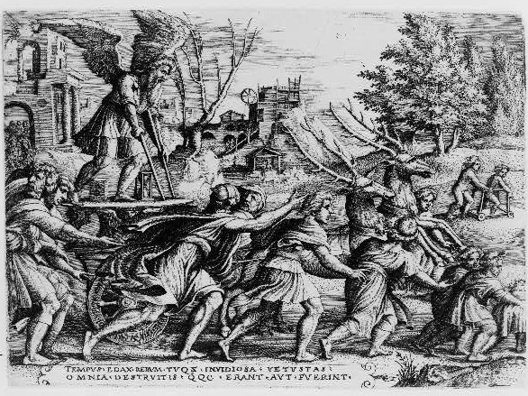
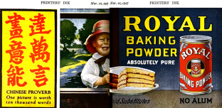
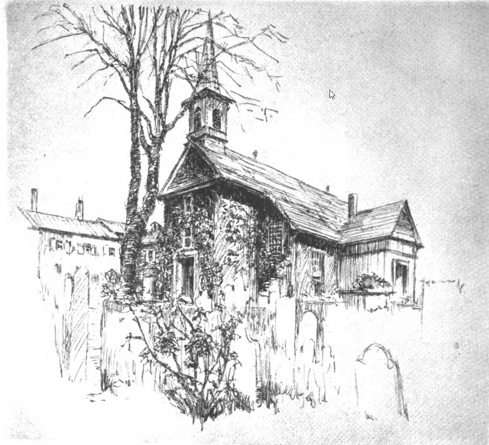
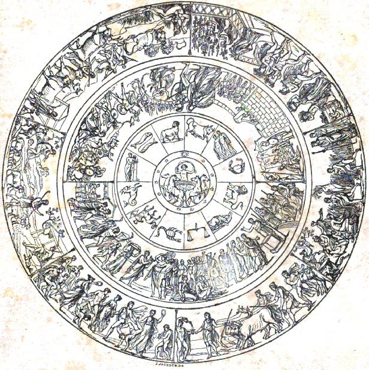

# How to Write with Style

In what follows, I will present five rules concerning style. These rules are for writing philosophical papers but they also apply to non-philosophical subject matters as well (e.g., argumentative writing more generally). I will provide arguments for these rules. Since I don't think any of these arguments are knockdown arguments, I'll present some criticisms to these rules. 

## Rule 1: Avoid jargon and five-dollar words

Before we formulate this rule more precisely, let's provide some informal definitions. "Jargon" refers to the technical terminology of a field of research, a profession, or special activity. Jargon tends to be difficult to understand by those not working in that special activity. For example, the term ["supervaluation"](https://doi.org/10.1111/j.1747-9991.2008.00124.x) is a piece of jargon used by logicians. Or, the term "gank" is a piece of jargon used by those that play the online video game [League of Legends](https://www.leagueoflegends.com/en-us/).

Consider the following quote attributed to Mark Twain:

> Don't use a five dollar word when a fifty cent word will do.

To understand this quote, let's define the meaning of a "fifty-cent word" and a "five-dollar word":

1. *fifty-cent word:* a short, simple, or frequently used word
1. *five-dollar word:* a long, complex, or uncommon (perhaps archaic) word (often perceived (by some) as being sophisticated or scholarly).

Some examples of five-dollar words and their roughly equivalent fifty-cent versions:

| Five-dollar word | Fifty-cent version |
| :------ | :------ |
| perspicacious  | insightful  |
| extemporize   | improvise  |
| coquettish   | flirtatious  |
| suffuse   | spread  |
| fastidious   | detail-oriented  |
| cromulent   | acceptable |
| betwixt   | between |

The meaning of the quote is now clear. If there is an fifty-cent word and a five-dollar word and the fifty-cent word works just as well for communicating your ideas, use the fifty-cent word instead.

Let's formulate our rule of style:

> Whenever possible, avoid jargon and five-dollar words in favor of shorter, simpler, and more common words.

Here is an argument in support of this rule:

- P1: One of the primary goals of writing is to communicate information as precisely as possible to your intended audience. 
- P2: The use of jargon and five-dollar words over equivalent fifty-cent words limits the number of people within your audience who will receive this information.
- C: Therefore, whenever possible, you ought to avoid jargon and five-dollar words.

In response to this rule, I've been told that the expression of your ideas is more important than the communication of them to an audience. That when people write, they are writing for themselves. They are trying to get their thoughts onto the page and so the rule to restrict language in this way runs in conflict with creative expression.

## Rule 2: Focus on your topic

Some people write about things that are not directly related to the primary topic. For example, suppose you are tasked with writing an essay about what an artwork says about time (its nature or our experience of it) and how it says it.

In the paper, you write about how fantastic the artwork is and how it has made an impression on millions of people across the globe. As your reader, I may agree with you, but this information is off topic: the task of the paper was to write about the artwork's relation to time, not to evaluate its quality or its impression on people.

Here is an argument in support of this rule:

- P1: One of the primary goals of writing is to communicate relevant information as precisely *and as quickly* as possible to your intended audience. 
- P2: Including irrelevant details in your writing takes time
- C: Therefore, only include information that is directly relevant to your topic.

In response to this rule, I've been told that these details often help engagement on a personal level. Writing is partly about self-expression.

## Rule 3: Avoid sweeping generalizations (even if true)

Suppose you have just read a very short [paper](https://doi.org/10.1093/analys/23.6.121) that has argued that "knowledge" should not be understood as "justified true belief". You will to develop this idea and so wish to use point to a few samples of philosophers who understand *do* understand "knowledge" in this way. Your plan, of course, is to show how they are mistaken. However, suppose you begin my paper as follows:

> From the dawn of time, philosophers have consider what it means to know something. 

There are a few things wrong with starting your paper in this way. First, you do not plan on writing a history of how philosophers have understood the meaning of "knowledge". So, this sentence is off topic (see Rule 2). Second, this particular generalization is *controversial* (and likely false). 

If we should avoid generalizing, what is a better way to start? My suggestion is that you restrict your claims to (1) generalizations that you have a high degree of confidence that others would accept or (2) what you can prove (or will prove in your paper). Here is a suggestion:

> In this paper, I provide evidence that some philosophers have analyzed "knowledge" as "justified, true belief. I argue that this analysis is mistaken.

Notice that rather than making a sweeping generalization over the history of time and philosophy, the above statement is restricted to what *some* philosophers think about knowledge. To prove this, you will provide examples in your paper.

Here is an argument in support of this rule:

- P1: One of the primary goals of writing is to communicate information that is  relevant and rationally supported, and to do so as precisely and as quickly as possible to your intended audience. 
- P2: Sweeping generalizations in your work tend not to be directly relevant to your paper topic and are usually not supported by evidence or argument.
- C: Therefore, avoid sweeping generalizations.

In response to this rule, I've been told that false generalizations encourages engagement. A provocative generalization challenges the reader to find counter-examples. 

## Rule 4: Avoid anecdotes

Suppose you are debunking arguments put forward by people who believe that the earth is flat (flat-earthers). In debunking these arguments, you offer a few stories about flat-earthers you've encountered. These stories are anecdotes. An *anecdote* is a short story involving a real event, experience, or person. Why are you offering up an anecdote?

First, you might offer an anecdote because it helps explain why you are interested in debunking the claims made by flat-earthers. If so, then, at least for one point in your writing, the debunking of the claims is not the subject matter. Rather, you are the subject matter. In some cases, your audience might not care about you or your motivation. They only want to know about the debunking. So, you are offering irrelevant information: [violation of rule 2](#rule-2-focus-on-your-topic).

Second, you might offer an anecdote as *evidence* for a claim you are making. One way to do this is to tell a story about a person who you take to be representative of a position you plan to criticize. In this case, ask yourself whether anything about the person is relevant for criticizing the position itself. For example, suppose again you plan on debunking positions held by flat-earthers. To introduce the topic, you offer an anecdote of a flat-earther you met. You point out their straggly appearance, indicate the political party they support, and describe some of their mannerisms. None of this is relevant to the debunking of the position.

It is my contention that, except in rare cases involving people who live extraordinary lives, adding anecdotes into one's writing should be avoided. They tend to be irrelevant, prompt readers to engage in fallacious forms of reasoning, and a waste of your reader's time.

- P1: One of the primary goals of writing is to communicate information that is  relevant and rationally supported, and to do so as precisely and as quickly as possible to your intended audience. 
- P2: Anecdotes tend to introduce irrelevant information.
- C: Therefore, avoid anecdotes.

In response to this rule, some people are highly impressed by personal anecdotes and so their use has persuasive value. If your concern is impressing your audience rather than rationally persuading them, then anecdotes can be a powerful tool.

## Rule 5: Use Examples and Illustrations to Aid Understanding

There is the famous saying (attributed to Confucius, Arthur Brisbane, and [Fred R. Barnard](https://en.wikipedia.org/wiki/Fred_Barnard), and others) that "a picture is worth a thousand words". 

It is hard to know what "worth" means here. It does seem that pictures and examples can be more "economical". For example, consider the following remark about etchings:

> "A capable etcher holds within a few black lines the interpretation of a romance and feeling impossible to tell in a thousand words or a dozen colors." (From *Printers' Ink Monthly*, Vol. 1, No. 10, Sept. 1920)

Whether pictures / examples are better or economical or not, they do tend to (1) aid in [understanding complex topics](https://nhmu.utah.edu/sites/default/files/trail-resource/b0973c177d7cac13ca0e80f2404999d56d3d.pdf) and (2) be memorable or attractive.

Here is an argument in support of the use of examples:

- P1: One of the primary goals of writing is to communicate information that is relevant and rationally supported, and to do so as precisely and as quickly as possible to your intended audience. 
- P2: Pictures, diagrams, and examples aid in understanding of complex (abstract) topics.
- C: Therefore, use plenty of pictures, diagrams, and examples.

In response to this rule, there is the claim that pictures and examples can mislead readers since they often oversimplify and are not as informative as written text. For example, compare various attempts to reproduce the shield of Achilles and compare it against Homer's description of it in *The Illiad*:

> From [The Illiad](https://classics.mit.edu/Homer/iliad.18.xviii.html) (Bk XVIII): "First he shaped the shield so great and strong, adorning it all over and binding it round with a gleaming circuit in three layers; and the baldric was made of silver. He made the shield in five thicknesses, and with many a wonder did his cunning hand enrich it. 
>
> He wrought the earth, the heavens, and the sea; the moon also at her full and the untiring sun, with all the signs that glorify the face of heaven- the Pleiads, the Hyads, huge Orion, and the Bear, which men also call the Wain and which turns round ever in one place, facing. Orion, and alone never dips into the stream of Oceanus.
> 
> He wrought also two cities, fair to see and busy with the hum of men. In the one were weddings and wedding-feasts, and they were going about the city with brides whom they were escorting by torchlight from their chambers. Loud rose the cry of Hymen, and the youths danced to the music of flute and lyre, while the women stood each at her house door to see them.
> 
> Meanwhile the people were gathered in assembly, for there was a quarrel, and two men were wrangling about the blood-money for a man who had been killed, the one saying before the people that he had paid damages in full, and the other that he had not been paid. Each was trying to make his own case good, and the people took sides, each man backing the side that he had taken; but the heralds kept them back, and the elders sate on their seats of stone in a solemn circle, holding the staves which the heralds had put into their hands. Then they rose and each in his turn gave judgement, and there were two talents laid down, to be given to him whose judgement should be deemed the fairest.
> 
> About the other city there lay encamped two hosts in gleaming armour, and they were divided whether to sack it, or to spare it and accept the half of what it contained. But the men of the city would not yet consent, and armed themselves for a surprise; their wives and little children kept guard upon the walls, and with them were the men who were past fighting through age; but the others sallied forth with Mars and Pallas Minerva at their head- both of them wrought in gold and clad in golden raiment, great and fair with their armour as befitting gods, while they that followed were smaller. When they reached the place where they would lay their ambush, it was on a riverbed to which live stock of all kinds would come from far and near to water; here, then, they lay concealed, clad in full armour. Some way off them there were two scouts who were on the look-out for the coming of sheep or cattle, which presently came, followed by two shepherds who were playing on their pipes, and had not so much as a thought of danger. When those who were in ambush saw this, they cut off the flocks and herds and killed the shepherds. Meanwhile the besiegers, when they heard much noise among the cattle as they sat in council, sprang to their horses, and made with all speed towards them; when they reached them they set battle in array by the banks of the river, and the hosts aimed their bronze-shod spears at one another. With them were Strife and Riot, and fell Fate who was dragging three men after her, one with a fresh wound, and the other unwounded, while the third was dead, and she was dragging him along by his heel: and her robe was bedrabbled in men's blood. They went in and out with one another and fought as though they were living people haling away one another's dead.
> 
> He wrought also a fair fallow field, large and thrice ploughed already. Many men were working at the plough within it, turning their oxen to and fro, furrow after furrow. Each time that they turned on reaching the headland a man would come up to them and give them a cup of wine, and they would go back to their furrows looking forward to the time when they should again reach the headland. The part that they had ploughed was dark behind them, so that the field, though it was of gold, still looked as if it were being ploughed- very curious to behold.
> 
> He wrought also a field of harvest corn, and the reapers were reaping with sharp sickles in their hands. Swathe after swathe fell to the ground in a straight line behind them, and the binders bound them in bands of twisted straw. There were three binders, and behind them there were boys who gathered the cut corn in armfuls and kept on bringing them to be bound: among them all the owner of the land stood by in silence and was glad. The servants were getting a meal ready under an oak, for they had sacrificed a great ox, and were busy cutting him up, while the women were making a porridge of much white barley for the labourers' dinner.
>   
> He wrought also a vineyard, golden and fair to see, and the vines were loaded with grapes. The bunches overhead were black, but the vines were trained on poles of silver. He ran a ditch of dark metal all round it, and fenced it with a fence of tin; there was only one path to it, and by this the vintagers went when they would gather the vintage. Youths and maidens all blithe and full of glee, carried the luscious fruit in plaited baskets; and with them there went a boy who made sweet music with his lyre, and sang the Linus-song with his clear boyish voice.  
>
> He wrought also a herd of homed cattle. He made the cows of gold and tin, and they lowed as they came full speed out of the yards to go and feed among the waving reeds that grow by the banks of the river. Along with the cattle there went four shepherds, all of them in gold, and their nine fleet dogs went with them. Two terrible lions had fastened on a bellowing bull that was with the foremost cows, and bellow as he might they haled him, while the dogs and men gave chase: the lions tore through the bull's thick hide and were gorging on his blood and bowels, but the herdsmen were afraid to do anything, and only hounded on their dogs; the dogs dared not fasten on the lions but stood by barking and keeping out of harm's way.

The god wrought also a pasture in a fair mountain dell, and large flock of sheep, with a homestead and huts, and sheltered sheepfolds.

Furthermore he wrought a green, like that which Daedalus once made in Cnossus for lovely Ariadne. Hereon there danced youths and maidens whom all would woo, with their hands on one another's wrists. The maidens wore robes of light linen, and the youths well woven shirts that were slightly oiled. The girls were crowned with garlands, while the young men had daggers of gold that hung by silver baldrics; sometimes they would dance deftly in a ring with merry twinkling feet, as it were a potter sitting at his work and making trial of his wheel to see whether it will run, and sometimes they would go all in line with one another, and much people was gathered joyously about the green. There was a bard also to sing to them and play his lyre, while two tumblers went about performing in the midst of them when the man struck up with his tune.

All round the outermost rim of the shield he set the mighty stream of the river Oceanus.
